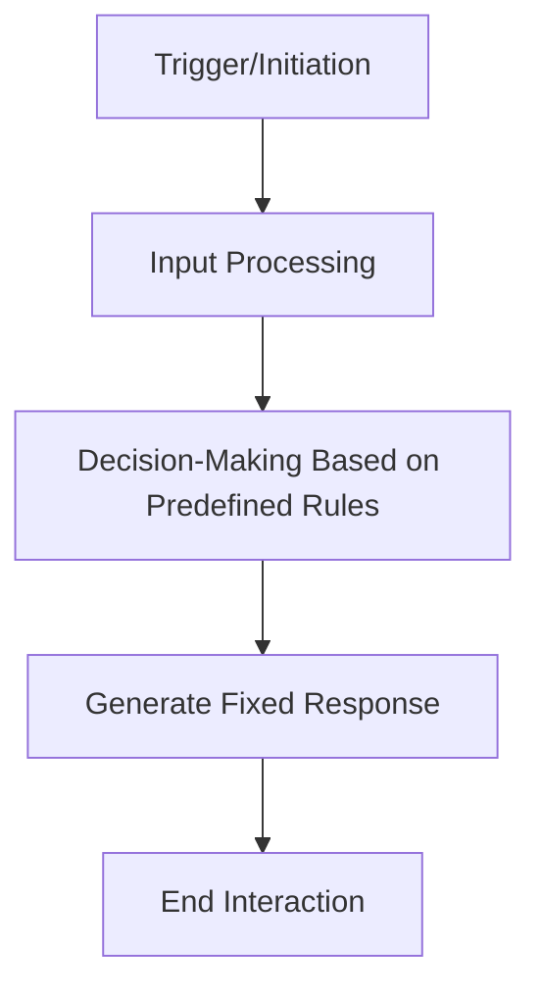
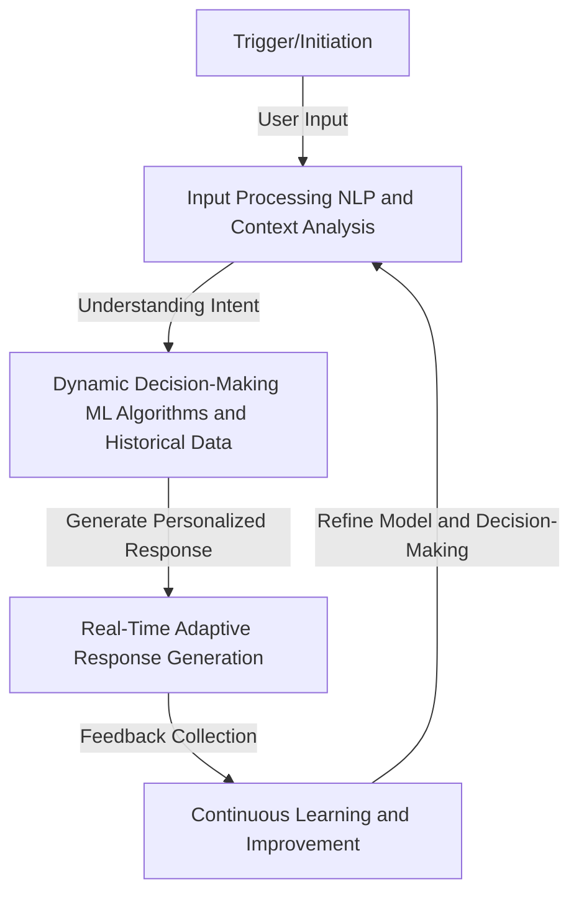

# 🚀 AI Agents: The Future of Intelligent Automation (2025 & Beyond)

**🔗 Repository:** [AI-Agents-Compound](https://github.com/Laihu08/Ai-Agents-Compound)

In our previous discussion, we explored the foundational concepts of **AI Agents**. Now, let’s take it to the next level!
This post will dive deep into the **evolution, impact, and step-by-step process of building AI Agents in 2025**, along with a **detailed flowchart** to visualize their workflow.

---

## 📌 What is an AI Agent?
At its core, an **AI Agent** is a software system that:

✅ Perceives its **environment**

✅ Processes **information**

✅ Takes **actions** to achieve specific goals

### 🔥 Why Are AI Agents So Important in 2025?
AI Agents have evolved beyond simple automation. They now integrate **machine learning**, **NLP**, and **adaptive decision-making**, making them:
- **Efficient** – Automating complex, data-driven tasks
- **Personalized** – Learning from user interactions
- **Innovative** – Transforming industries like healthcare, finance, and retail
- **Adaptive** – Evolving with real-time data

---

## 🔍 Rule-Based vs. Learning-Based AI Agents

| **Type**        | **Description** | **Example** |
|---------------|--------------|------------|
| **Rule-Based**  | Follows fixed logic, pre-defined rules, and scripts. | Chatbots with static responses |
| **Learning-Based** | Uses Machine Learning to **adapt** and improve over time. | AI Assistants like ChatGPT, recommendation engines |

### 🛠 Hybrid AI Agents – The Best of Both Worlds
Modern AI Agents combine:

✅ **Rule-Based Logic** for **predictability**

✅ **Machine Learning** for **adaptability**

---

## 📜 AI Agent Workflow – From Basic to Advanced

### **🔗 Basic AI Agent Workflow (Rule-Based)**

### **⚡ Advanced AI Agent Workflow (AI-Powered)**

🔹 **What’s New in Advanced AI Agents?**
- 🔍 **Natural Language Understanding** → Context-aware responses  
- 🔗 **Adaptive Learning** → Continuously improving responses  
- ⚡ **Integration with CRM/Data** → Personalized user experience  

---

## 🏗 How to Build Your Own AI Agent?

Building an AI Agent is an exciting challenge! Here’s a **step-by-step guide**:

### **Step 1: Define Your Objective**
🔹 What problem will your AI Agent solve?

✔ Customer support?

✔ Code generation?

✔ AI-powered recommendations?

### **Step 2: Choose the Right Tools**
**For Developers:**

✅ Python (Recommended) → Libraries like TensorFlow, PyTorch, Hugging Face

✅ LangChain, OpenAI API for LLM-based AI Agents

**For Non-Developers:**

✅ No-code platforms → Google’s Dialogflow, IBM Watson Assistant

### **Step 3: Design Your AI System**
Key components to structure your AI Agent:

✅ **Input Processing** – Text, voice, images

✅ **Processing & Decision-Making** – ML model selects the right response

✅ **Response Generation** – AI formulates reply

✅ **Learning & Adaptation** – System improves over time

### **Step 4: Train Your AI Model**
📊 **Data Preparation**
- Clean and pre-process training data
- Use datasets from **Kaggle**, **Hugging Face**, or create your own

📈 **Training**
- Use **Supervised Learning** for rule-based tasks
- Use **Reinforcement Learning** for adaptive behavior

### **Step 5: Test & Deploy Your AI Agent**
✔ Run test cases to refine accuracy
✔ Deploy on cloud (AWS, GCP, Azure)
✔ Integrate with APIs (Slack, Telegram, Discord, WhatsApp)

---

## 🎯 Key Takeaways

✅ AI Agents are **more intelligent, adaptive, and integrated** than ever  

✅ The **hybrid approach** combines **rule-based** and **learning-based** systems  

✅ AI Agents are **revolutionizing** industries with **personalization & automation**  

✅ Building an AI Agent requires **defining objectives, choosing the right tools, training models, and testing deployment**  

---

## 🎓 What’s Next?
💡 Want to **build your own AI Agent?**  
🔥 Let’s create a **real-world AI agent** in this repository!  

📌 **Vote in the comments**:

1️⃣ **Code-based AI Agent** (Python & ML)  

2️⃣ **No-Code AI Agent** (Google Dialogflow, IBM Watson)  

**Drop your preference & I’ll start a build series! 🚀**  

📌 Stay tuned for **tutorials, real-world examples, and advanced AI models!**  

👨‍💻 **Contribute** → Pull requests & ideas are welcome!  

🚀 **Let's shape the future of AI Agents together!** 💡
